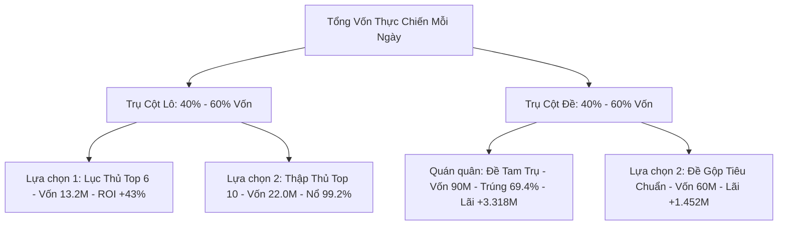

# Bách Khoa Toàn Thư Phương Pháp Xổ Số: Danh Mục Toàn Phổ Lô & Đề (Comprehensive Methods Catalog)

Bách khoa toàn thư phân loại, đối chiếu công thức, ma trận rủi ro và hiệu năng thực chiến của **TẤT CẢ** các phương pháp Lô và Đề trong hệ thống **Lottery Predictive Intelligence**, tuân thủ 100% nguyên tắc **Strict Point-In-Time (Strict PIT)** dựa trên dữ liệu 20+ năm Xổ số Miền Bắc (2005–2026, 7.545 kỳ quay).

---

## 1. Phổ Phương Pháp Đề (Đặc Biệt 2 Số Cuối)

### 1.1. Bảy (07) Phương Pháp Đơn Lẻ Nền Tảng (Single Baseline Methods - Pool 7)

Tất cả các phương pháp đơn lẻ đều tạo ra dàn **30 số** cố định, được huấn luyện và đóng băng theo mô hình hàng năm (Annual Frozen Baseline):

1. **`dedupEdge50Hold70` - Dự đoán Edge 50% Khử Trùng (Hold 70)**:
   - *Cơ chế*: Lọc biên tần suất xuất hiện với ngưỡng tin cậy 50%, loại bỏ các số trùng lặp trong cụm và duy trì thời gian giữ nhịp 70 kỳ.
   - *Đặc điểm*: Độ ổn định cao, phản ứng vừa phải với biến động ngắn hạn.

2. **`dedupEdge75Hold70` - Edge 75% PIT Có Kiểm Chứng (Hold 70)**:
   - *Cơ chế*: Đặt ngưỡng biên khắt khe 75% kèm xác thực Strict Point-In-Time, chỉ giữ lại các số có xác suất hậu nghiệm vượt trội.
   - *Đặc điểm*: Tỷ lệ trúng độc lập thuộc nhóm cao nhất trong các phương pháp đơn lẻ.

3. **`dedupDropoffHold70` - Dropoff Khử Trùng Tập Số (Hold 70)**:
   - *Cơ chế*: Khai thác hiện tượng suy giảm đột ngột (dropoff) của chuỗi tần suất, nhận diện thời điểm một cụm số chuẩn bị tái xuất hiện sau chu kỳ vắng bóng.
   - *Đặc điểm*: Bắt nhịp hồi phục sau chu kỳ gan ngắn cực tốt.

4. **`avgEdge50Hold70` - Dropoff Trung Bình Từng Số (Hold 70)**:
   - *Cơ chế*: Tính giá trị kỳ vọng trung bình trượt của từng con số kết hợp ngưỡng biên 50%.
   - *Đặc điểm*: Độ mượt cao, giảm thiểu nhiễu đột biến trong ngày.

5. **`chainSmallFirstHold70` - Đề Chuỗi Nhỏ Trước (Hold 70)**:
   - *Cơ chế*: Ưu tiên các chuỗi có bước nhảy nhỏ (nhịp rơi dày 1–3 kỳ) xuất hiện trước trong lịch sử.
   - *Đặc điểm*: Rất mạnh trong giai đoạn thị trường đi theo dạng bệt chạm hoặc bệt tổng.

6. **`edgeHold70` - Nhịp Block Trước (Hold 70)**:
   - *Cơ chế*: Phân tích khối 10 số (Block) có mật độ xuất hiện cao ở các kỳ quay gần nhất.
   - *Đặc điểm*: Bắt các cụm đầu/đuôi tập trung rất hiệu quả.

7. **`dedupEdge50CombinedB40S05Hold70` - Đề Boost B40S05 Kết Hợp (Hold 70)**:
   - *Cơ chế*: Kết hợp thuật toán Edge 50% với hệ số khuếch đại Boost Block 40 và Smooth 0.05.
   - *Đặc điểm*: Tối ưu hóa xác suất biên, độ nhạy cao với các dạng số đảo.

---

### 1.2. Ba (03) Phương Pháp Đề Gộp Thực Chiến (Multi-Method Ensembles)

| Đặc tính | Đề Gộp 1: Tiêu Chuẩn (`dualMerge`) | Đề Gộp 2: Thích Ứng Alpha (`adaptiveDualMerge`) | Đề Gộp 3: Tam Trụ (`tripleMerge`) |
| :--- | :--- | :--- | :--- |
| **Số thuật toán gộp** | 2 phương pháp | 2 phương pháp (chọn động từ 21 cặp) | 3 phương pháp (chọn động từ 35 bộ ba) |
| **Phân tầng cược** | 2 tầng: X2 (trùng) & X1 (riêng) | 2 tầng: X2 (trùng) & X1 (riêng) | 3 tầng: X3 (trùng 3), X2 (trùng 2), X1 (riêng) |
| **Tổng vốn / ngày** | Cố định **60M (60.000K)** | Cố định **60M (60.000K)** | Cố định **90M (90.000K)** |
| **Mức thưởng trúng lớn nhất** | Ăn X2: **168M** (Lãi **+108M**, ROI +180%) | Ăn X2: **168M** (Lãi **+108M**, ROI +180%) | Ăn X3: **252M** (Lãi **+162M**, ROI +180%) |
| **Mức thưởng bọc lót** | Ăn X1: **84M** (Lãi **+24M**, ROI +40%) | Ăn X1: **84M** (Lãi **+24M**, ROI +40%) | Ăn X2: **168M** (Lãi **+78M**) / Ăn X1: **84M** (Lỗ nhẹ -6M) |
| **Cơ chế thích ứng** | Xung lực lùi 30/15/7 ngày + Sweet-spot Overlap + Form Resonance | Chế độ Tấn Công (Offensive) vs Phòng Thủ (Defensive) | Sweet-Spot Triad Overlap + Xung lực bộ ba + Form Resonance |
| **Tỷ lệ trúng 2026** | **55.1%** (135/245 ngày) | **56.3%** (138/245 ngày) | **69.4% (170/245 ngày)** |
| **Lợi nhuận lũy kế 2026** | **+1.452M** (ROI +9.9%) | **+2.544M** (ROI +17.3%) | **+3.228M (ROI +14.6%) [QUÁN QUÂN]** |

---

### 1.3. Phương Pháp Tuyển Chọn Độc Lập & Đồng Thuận (Selectors & Consensus)
- **`balanced-selector-fixed30-v1` (Bộ chọn cân bằng)**: Tự động chọn 1 dàn 30 số tốt nhất từ các phương pháp nền tảng bằng posterior Bayes 7/30/90 kỳ kết hợp cận dưới khoảng tin cậy Wilson.
- **`all-method-fixed30-consensus-v1` (Đồng thuận toàn bộ dàn 30)**: Bỏ phiếu có trọng số qua toàn bộ các dàn ứng viên để chọn ra dàn 30 số có độ đồng thuận liên thuật toán cao nhất.

---

## 2. Phổ Phương Pháp Lô (27 Giải Xổ Số Miền Bắc)

Lô miền Bắc có 27 giải thưởng, xác suất một con số xuất hiện trong bảng kết quả là xấp xỉ $1 - (0.99)^{27} \approx 23.78\%$.

### 2.1. Động Cơ Siêu Hợp Nhất QMBF v5 (Quantum Bayes-Markov Fusion)
QMBF v5 tích hợp **7 động cơ độc lập** thông qua thuật toán dung hợp thứ hạng tương hỗ (Reciprocal Rank Fusion - RRF, $K = 20.0$):

1. **Engine 1: Positional Markov Tensor ($w = 1.90$)**:
   - Ma trận chuyển trạng thái 3 bậc trễ (Lag 1, Lag 2, Lag 3) trên 20+ năm.
   - Gán trọng số đặc biệt cho vị trí giải: Giải Đặc Biệt (3.6x), Giải Nhất (2.6x), Giải 7 (2.0x).
2. **Engine 2: Head-Tail Bayes Dynamic Momentum ($w = 0.30$)**:
   - Xác suất Bayes phân tích độc lập đầu số ($0-9$) và đuôi số ($0-9$).
3. **Engine 3: Co-occurrence PMI Affinity Matrix ($w = 0.25$)**:
   - Lực hút cặp số cùng về (Pointwise Mutual Information) trên không gian ma trận đối xứng $100 \times 100$.
4. **Engine 4: Short-term Gap Momentum & Recency ($w = 0.30$)**:
   - Sóng xung lực đàn hồi nhịp rơi trong 20 kỳ gần nhất với hàm suy giảm $e^{-0.10 \times \Delta t}$.
5. **Engine 5: Shadow & Inverse Pair Synergy ($w = 0.15$)**:
   - Tương quan cặp số đảo vị trí (như $35 \leftrightarrow 53$) và bóng âm dương ngũ hành.
6. **Engine 6: Positional Bridge Correlation ($w = 0.20$)**:
   - Đồ thị cầu ghép các vị trí trọng điểm: GĐB, G1 và 4 con số của G7.
7. **Engine 7: Form & Parity Transition Resonance ($w = 0.20$)**:
   - Cộng hưởng dạng số: Chạm rơi, chuyển dịch tổng lân cận và số đảo từ giải đặc biệt $D-1$.
8. **Bộ lọc Đa Dạng Hóa Đuôi Số (`maxPerTail: 2`)**:
   - Ngăn chặn hiện tượng dồn quá nhiều số vào một đầu/đuôi, bảo hiểm rủi ro gãy cầu hàng loạt.

---

### 2.2. Bảy (07) Mức Cược Phân Tầng Lô Theo Số Lượng (Loto Top Counts)

Chi phí: **2.200K / điểm (số)**. Tiền thưởng: **8.000K / nháy**.

| Cấu hình | Vốn / ngày | Ngày nổ / Tổng ngày | Tỷ lệ ngày nổ | Tỷ lệ thắng lãi | Lãi lũy kế 2026 | ROI 2026 | Đánh giá Chiến Thuật |
| :--- | :---: | :---: | :---: | :---: | :---: | :---: | :--- |
| **Song Thủ (Top 2)** | 4.4M | 109 / 245 | 44.5% | 44.5% | +311.2M | +28.9% | Vốn siêu nhỏ, dành cho người thích cảm giác mạnh. |
| **Tứ Thủ (Top 4)** | 8.8M | 142 / 245 | 58.0% | 58.0% | +756.8M | +35.1% | Cân bằng vốn tốt, tỷ lệ nổ trên 58%. |
| **Lục Thủ (Top 6)** | 13.2M | **228 / 245** | **93.1%** | **70.2%** | **+1.422M** | **+43.0%** | **HIỆU SUẤT TỐI ƯU**: Tỷ lệ nổ 93.1%, ROI cao nhất (+43%). |
| **Thất Thủ (Top 7)** | 15.4M | 235 / 245 | 95.9% | 68.2% | +1.584M | +42.0% | Tỷ lệ nổ xấp xỉ 96%. |
| **Bát Thủ (Top 8)** | 17.6M | 239 / 245 | 97.6% | 66.5% | +1.720M | +39.9% | Chuỗi trượt tối đa chỉ 1 ngày. |
| **Thập Thủ (Top 10)** | 22.0M | **243 / 245** | **99.2%** | **65.3%** | **+2.016M** | **+37.3%** | **ĐỘ BỀN BỈ KỶ LỤC**: 243/245 ngày có nháy, lãi vượt 2 Tỷ. |
| **Lô Dàn 20 (Top 20)**| 44.0M | **245 / 245** | **100.0%** | **59.6%** | **+2.852M** | **+26.5%** | **BẤT KHẢ CHIẾN BẠI**: 100% các ngày đều nổ nháy, lãi lớn nhất. |

---

### 2.3. Lô Cặp & Ghép Xiên (Xiên 2, Xiên 3)
- **Cặp Song Lô Tương Hỗ**: Lựa chọn 2 số trong Top 6 có điểm lực hút $\text{PMI}(A, B)$ cao nhất để đánh cặp song thủ.
- **Ghép Xiên 2 Tự Động**: Chọn 3-5 cặp xiên có xác suất cùng xuất hiện vượt ngưỡng $P(A \cap B) > 0.08$.

---

## 3. Khuyến Nghị Phối Hợp Danh Mục Thực Chiến (Live Combat Allocation)

Một danh mục thực chiến thông minh nên phân bổ vốn cân bằng giữa Lô và Đề để triệt tiêu biến động:

