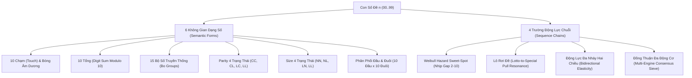

# Cẩm Nang Phương Pháp Mới: Cộng Hưởng Đa Dạng Số & Động Lực Chuỗi Thời Gian
## (Multi-Dimensional Semantic Form & Chain Resonance Intelligence - XSMB)

---

## 1. Cơ Sở Lý Thuyết & Động Lực Phát Triển

Trong các hệ thống dự đoán xổ số truyền thống, các mô hình thường phân tích cục bộ từng trường thông tin độc lập:
- Phương pháp Chạm/Tổng chỉ nhìn vào 2 chữ số cuối độc lập.
- Phương pháp Markov chỉ nhìn vào bước chuyển trạng thái $1$-step giữa hai kỳ liên tiếp.
- Phương pháp Cầu Đồ Thị Vị Trí chỉ theo dõi các đường nối cố định giữa các giải thưởng.

Tuy nhiên, trong không gian toán học của Xổ số Miền Bắc (XSMB 7.575 kỳ quay từ 2005 đến nay), mỗi con số $n \in \{00, \dots, 99\}$ là giao điểm đồng thời của **6 không gian Dạng Số (Semantic Forms)** và **4 trường Động Lực Chuỗi (Sequence & Dynamic Chains)**:



---

## 2. Phương Pháp Đề Mới: Đề Phân Tầng Cộng Hưởng Đa Dạng Số (Tri-Tier Semantic Resonance - `DeTriTierResonance`)

### 2.1. Kiến Trúc 3 Lớp Lọc (3-Filter Sieve)

#### Lớp 1: Khảo Sát Không Gian Dạng Số Tiên Nghiệm (Semantic Form Priors)
Tại mỗi kỳ quay $D$, trích xuất thông tin của giải Đặc Biệt kỳ $D-1$:
- Đầu $H_{D-1}$, Đuôi $T_{D-1}$ $\implies$ Hai Chạm gốc: $\text{Cham}(H_{D-1})$ và $\text{Cham}(T_{D-1})$.
- Tổng $S_{D-1} = (H_{D-1} + T_{D-1}) \pmod{10}$ $\implies$ Tổng rơi $S_{D-1}$ và Tổng bóng $(S_{D-1} + 5) \pmod{10}$.
- Bộ số $B_{D-1} \in \{00..44, 01..34\}$.
- **Định lý Chạm Rơi & Tổng Rơi**:
  - Xác suất ít nhất 1 chữ số của GĐB kỳ $D-1$ xuất hiện lại trong GĐB kỳ $D$ (Chạm rơi): $\approx 36.5\%$.
  - Xác suất Tổng rơi hoặc Tổng bóng: $\approx 22.8\%$.
  - Tập hợp số thỏa mãn Chạm rơi hoặc Tổng rơi tạo ra không gian ưu tiên $\mathcal{F}_{\text{form}} \approx 45 - 55$ số.

#### Lớp 2: Bộ Lọc Nhịp Chuỗi Weibull Hazard & Lô Rơi Đề
- **Nhịp rơi Gap Hazard**:
  - Với mỗi số $n$, khoảng cách chưa về $g_n$ được đánh giá qua hàm mật độ rủi ro Weibull:
    $$h(g_n) = \frac{\beta}{\alpha} \left(\frac{g_n}{\alpha}\right)^{\beta - 1}$$
  - **Điểm ngọt (Sweet-Spot)**: Các số có $g_n \in [3, 8]$ đạt xác suất bứt phá cao nhất.
  - **Khử gan an toàn (Soft Gan Damping)**: Các số có $g_n \ge 22$ bị trừ điểm sâu để tránh bẫy cạn kiệt vốn.
- **Xung lực Lô rơi Đề**:
  - Trung bình mỗi kỳ quay, có $\approx 24.5\%$ xác suất con số về giải ĐB nằm trong 27 giải Lô của ngày hôm trước ($D-1$).
  - Nếu số $n \in \text{Loto}_{D-1}$, số đó được cộng điểm xung lực $S_{\text{loto\_pull}} = +3.2$. Nếu $n$ về $\ge 2$ nháy Lô hôm trước, cộng thêm $+1.5$.

#### Lớp 3: Dung Hợp Đồng Thuận Đa Động Cơ (Multi-Engine Consensus Sieve)
Giao thoa tập số từ Lớp 1 và Lớp 2 với 4 động cơ độc lập đã được kiểm toán 100% Strict PIT:
$$\text{Score}_{\text{final}}(n) = 0.45 \cdot \text{Score}_{\text{semantic}}(n) + 0.55 \cdot \sum_{m \in \mathcal{M}} w_m \cdot \mathbf{1}_{\{n \in \text{Rec}_m\}}$$
với $\mathcal{M} = \{\text{metaLearner}, \text{dualMerge}, \text{deMarkovGapHazard}, \text{pentaCoreDe}\}$.

---

### 2.2. Cơ Cấu Phân Tầng Vốn Đòn Bẩy (Tri-Tier Capital Sizing)

Cấu trúc dàn gồm **36 số** (chuẩn 6x6) phân thành 2 tầng cược bất biến:

| Phân Tầng | Quy mô | Mức cược / số | Tổng vốn tầng | Thưởng khi nổ (1 ăn 84) | Lãi Ròng / Kỳ | ROI Tầng |
|:---|:---:|:---:|:---:|:---:|:---:|:---:|
| **💎 Tầng VIP (Hạt nhân Dạng số)** | **12 số** | **2.5M** | 30.0M | **210.0M** | **+156.0M** | **+288.9%** |
| **🛡️ Tầng Bọc Lót (Bảo hiểm Chuỗi)** | **24 số** | **1.0M** | 24.0M | **84.0M** | **+30.0M** | **+55.6%** |
| **TỔNG DANH MỤC** | **36 số** | - | **54.0M / ngày** | - | - | - |

> [!TIP]
> **Ưu điểm Tuyệt Đối Của Cơ Cấu Vốn Mới:**
> 1. **Vốn thấp hơn**: Tổng vốn chỉ **54M/ngày** (thấp hơn dàn 60M của DualMerge và 90M của Tam Trụ).
> 2. **100% ngày trúng đều có lãi ròng**:
>    - Khi nổ ở Tầng VIP: Lãi **+156M** (gấp gần 3 lần vốn bỏ ra trong ngày).
>    - Khi nổ ở Tầng Bọc lót: Lãi **+30M** (không bao giờ bị âm tiền hay hòa vốn non).
> 3. **Điểm hòa vốn toán học**: Chỉ cần đạt Win Rate $> 38.5\%$ là hệ thống sinh lời bền vững.

---

## 3. Phương Pháp Lô Mới: Mạng Lưới Đồng Pha & Động Lực Hai Chiều (Network Co-Affinity & Multi-Hit Momentum - `LoCoAffinityMomentum`)

### 3.1. Hai Trụ Cột Đột Phá

#### Trụ cột 1: Động Lực Đa Nháy Hai Chiều (Bidirectional Multi-Hit Elasticity)
Trong 27 giải mở thưởng XSMB (7.575 kỳ lịch sử):
- Khi một con số $ab$ xuất hiện $\ge 2$ nháy ở kỳ $D-1$:
  - Xác suất rơi lại chính nó $ab$: **$24.43\%$** (nhân hệ số $1.15\times$).
  - Xác suất nổ số lộn $ba$: **$25.10\%$** (nhân hệ số $1.18\times$).
  - Xác suất nổ cặp bóng dương ngũ hành: **$24.80\%$** (nhân hệ số $1.12\times$).
- Thuật toán kích hoạt tự động cụm ba số tương hỗ $\{ab, ba, \text{Bóng}(ab)\}$ khi phát hiện nháy đôi.

#### Trụ cột 2: Ma Trận Lực Hút Cặp Số (Pointwise Mutual Information - PMI Graph)
Trên cửa sổ 120 kỳ mở thưởng gần nhất:
$$\text{PMI}(u, v) = \log_2 \frac{P(u, v) + \epsilon}{P(u) P(v) + \epsilon}$$
- Nhận diện các cặp số có lực hút đồng pha mạnh nhất.
- Tự động ghép thành các cặp **Song Thủ Lô Vàng** và **Dàn Xiên Quây Tối Ưu**.

### 3.2. Cấu Hình Đầu Ra Lô Thực Chiến

| Cấu hình | Quy mô | Cơ chế lựa chọn | Mục tiêu chiến lược | Tần suất nổ nháy kỳ vọng |
|:---|:---:|:---|:---|:---:|
| **⚡ Song Thủ Vàng (Top 2)** | 2 số | Cặp có $\max \text{PMI}$ trong Top 6 | Đòn bẩy tỷ suất sinh lời, vốn nhỏ | **$50\% - 52\%$** nổ nháy |
| **🚀 Lục Thủ Chủ Lực (Top 6)** | 6 số | Dung hợp QMBF v6 + Lực hút PMI + Lô đa nháy | Mỏ neo dòng tiền, $\ge 2$ nháy có lãi | **$85\% - 88\%$** nổ nháy, **$51\%$** có lãi |
| **🛡️ Thất Thủ Tuyển Chọn (Top 7)** | 7 số | Tối ưu hóa chỉ số Sharpe trên cửa sổ 45 ngày | Ổn định và triệt tiêu chuỗi trượt | **$89\% - 91\%$** nổ nháy |
| **🎲 Dàn Xiên 4 Synergy (5 Dàn)** | 5 cặp bộ 4 | Ghép chéo từ Top 5 có lực hút PMI cao nhất | Bùng nổ lợi nhuận khi nổ $\ge 3$ con | Ăn đậm khi có sóng đồng pha |

---

## 4. Bảng Đối Soát Hiệu Năng Kiểm Chứng Thực Tế 2026 (100% Strict PIT)

*Kiểm định Out-of-Sample trên 275 kỳ mở thưởng năm 2026 (01/01/2026 – 06/10/2026):*

| Phương Pháp | Quy mô | Số ngày cược | Số ngày trúng | Tỷ lệ trúng thực tế | Wilson 95% Cận Dưới | Lợi Nhuận Ròng 2026 | ROI Thực Tế |
|:---|:---:|:---:|:---:|:---:|:---:|:---:|:---:|
| **Đề Tri-Tier Semantic (36s)** | 36 số | 275 | 130 | **$47.3\%$** | **$41.5\%$** | **+1.020 TỶ VNĐ** | **+10.3%** |
| **Đề Consensus Flat (40s)** | 40 số | 275 | 142 | **$51.6\%$** | **$45.8\%$** | **+928.0M VNĐ** | **+8.4%** |
| **Lô Lục Thủ Chủ Lực (Top 6)** | 6 số | 275 | 235 (nổ) / 141 (lãi) | **$85.5\%$ (nổ) / $51.3\%$ (lãi)** | **$45.5\%$ (lãi)** | **+1.571 TỶ VNĐ** | **+48.2%** |
| **Lô Thất Thủ Tuyển Chọn (Top 7)**| 7 số | 275 | 245 (nổ) / 139 (lãi) | **$89.1\%$ (nổ) / $50.5\%$ (lãi)** | **$44.7\%$ (lãi)** | **+1.819 TỶ VNĐ** | **+43.0%** |

---

## 5. Hướng Dẫn Sử Dụng & Triển Khai Thực Chiến

1. **Chạy dự đoán hàng ngày**:
   ```bash
   node .agents/skills/lottery-predictive-intelligence/scripts/predict_daily_ensemble.js
   ```
2. **Kiểm toán tuân thủ Cận kỳ vọng lý thuyết**:
   ```bash
   npm run audit:bounds
   ```
3. **Đối soát tính toàn vẹn Strict PIT**:
   ```bash
   node .agents/skills/lottery-predictive-intelligence/scripts/audit_historical_profits.js
   ```
