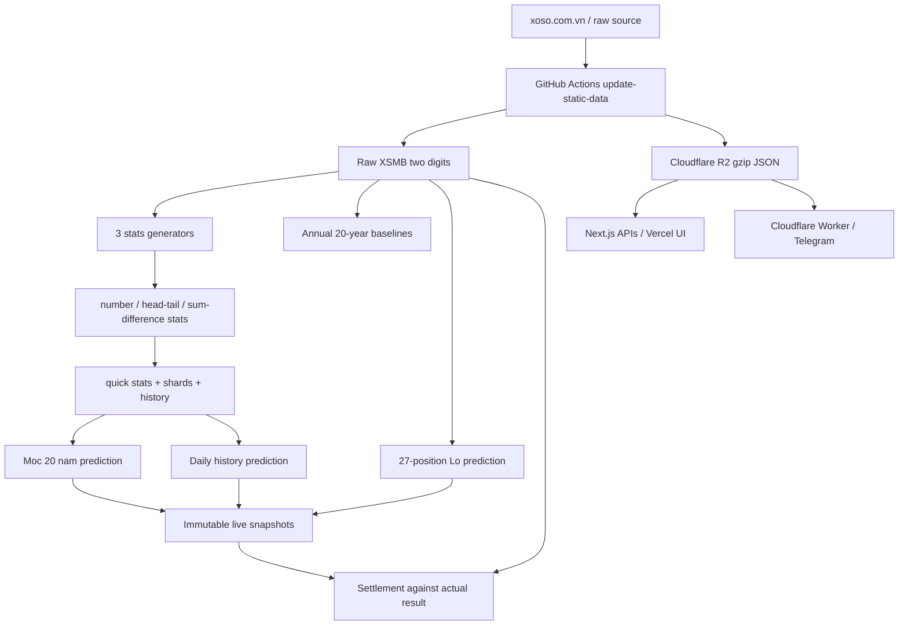

# XSMB Stats - Logic, Dinh Nghia va Kien Truc Du An

> Tai lieu nguon su that cho agent va lap trinh vien. Noi dung duoc doi chieu tu ma nguon hien tai ngay 14/07/2026, khong duoc suy dien tu giao dien cu hay cac bao cao backtest da sinh truoc do.

## 1. Muc dich va quy uoc su dung tai lieu

Du an thu thap ket qua XSMB, sinh cac chuoi thong ke tren hai so cuoi, xep hang rui ro de tao dan danh/loai, luu snapshot du doan bat bien, doi chieu ket qua thuc te, backtest point-in-time va phat hanh du doan qua web/API/Telegram.

Tai lieu nay mo ta:

- kien truc runtime va luong du lieu;
- mo hinh ket qua XSMB va 27 vi tri Lo;
- toan bo ho tap so, cac kieu chuoi va cu phap khoa thong ke;
- khai niem chuoi dang dien ra, tiem nang, ky luc, sieu ky luc va chua tung hinh thanh;
- cach tinh tan suat, dropoff, Wilson, Tier va xep hang;
- logic Moc 20 nam, Lich su hang ngay, Lo 27 vi tri;
- cong thuc tien, x2, danh, om, hit va profit;
- cache R2, API, GitHub Actions, Cloudflare Worker, Telegram va bao mat;
- phan production, legacy va research de agent khong dung nham.

Quy tac uu tien khi tai lieu va code mau thuan:

1. Snapshot da phat hanh la nguon su that cho mot du doan thuc te.
2. Code production va version cache hien tai cao hon tai lieu.
3. Du lieu R2 cao hon file JSON local tren Vercel/production.
4. Ket qua strict point-in-time cao hon bao cao fast-history hoac bao cao cu.
5. Can cap nhat tai lieu trong cung thay doi neu sua dinh nghia pattern, Tier, economics, method ID hoac cache schema.

Khong coi day la cam ket loi nhuan. Xo so la qua trinh ngau nhien; backtest chi la bang chung lich su va rat de bi overfit/leak neu sai moc du lieu.

## 2. Trang thai cac phan trong kho ma

### 2.1 Production hien tai

- Next.js App Router phuc vu HTML cu trong `views/` va cac API trong `app/api/`.
- Cloudflare R2 la kho raw data, statistics va cache production chinh.
- GitHub Actions cap nhat raw, sinh stats/cache, kiem tra va kich hoat Vercel.
- Cloudflare Worker goi workflow luc 18:40 GMT+7 va lam cong Telegram.
- Moc 20 nam tao baseline khoa theo tung nam.
- Lich su hang ngay tao snapshot PIT va khong duoc tinh lai dan da cong bo.
- Lo tinh rieng 27 vi tri, tong hop bang rank fusion.

### 2.2 Tuong thich/legacy

- Adapter va migration Supabase van con trong repo, nhung khong phai nguon production mac dinh.
- Cac cache simulation 7/14/30/60/90/180/365 ngay va mot so method cu van ton tai de xem lai.
- Mot so route scoring/future simulation la cong cu cu hoac nghien cuu, khong phai mac dinh phat hanh du doan.
- File JSON local la fallback/debug va nguon sinh, khong phai nguon su that production khi R2 duoc cau hinh.

### 2.3 Research/backtest

- `scripts/research-*.js`, `scripts/backtest-*.js`, `outputs/`, `reports/` la dau ra nghien cuu.
- Mot report chi co gia tri voi fingerprint code/data/config cua lan chay do.
- Khong duoc dung ket qua fast history de tuyen bo PIT.
- Khong dua method research vao default neu chua co snapshot bat bien, test leakage va so sanh out-of-sample.

## 3. Kien truc tong the



### 3.1 Cac lop chinh

- `lib/data-access.js`: adapter doc raw/stats tu R2, local hoac Supabase legacy.
- `lib/generators/`: sinh toan bo chuoi lich su.
- `lib/utils/numberAnalysis.js`: dinh nghia 00-99 va cac tap so.
- `public/js/stats-config.js`: manifest giao dien va nguon danh sach khoa mong doi.
- `lib/utils/statsOptionsManifest.js`: nap manifest, phan loai no-data/invalid.
- `lib/utils/quickStatsCalculator.js`: tong hop ky luc, current, target, dropoff va reliability.
- `lib/services/statisticsService.js`: hydrate/tra ket qua thong ke va du doan tong hop.
- `lib/services/exclusionLogicService.js`: suy ra tap so cho ngay tiep theo va priority cu.
- `lib/services/annualMilestoneService.js`: baseline Moc 20 nam, strategy, live snapshots va settlement.
- `lib/services/simulationService.js`: Lich su, simulation va cac method cu/nghien cuu.
- `lib/services/predictionHistoryService.js`: doc/ghi va bao ve nhat ky du doan.
- `scripts/backtest-loto-milestone20y.js`: logic vi tri va Lo production/research.
- `scripts/update-static-data.js`: orchestration cap nhat hang ngay.
- `workers/daily-update-dispatcher/src/index.js`: cron dispatch va Telegram.

## 4. Mo hinh du lieu XSMB

### 4.1 Raw row

Moi ngay co mot object voi `date` va ket qua cac giai. He thong lay hai chu so cuoi cua moi vi tri. Giai dac biet (`special`) la nguon cua bai toan De.

### 4.2 Hai so 00-99

- Moi so duoc chuan hoa thanh chuoi hai ky tu: `0` thanh `00`, `7` thanh `07`.
- Dau la hang chuc, dit la hang don vi.
- Toan bo mien mau la 100 so `00..99`.

### 4.3 27 vi tri Lo

Thu tu vi tri co dinh:

1. `special`
2. `prize1`
3. `prize2_1`, `prize2_2`
4. `prize3_1` den `prize3_6`
5. `prize4_1` den `prize4_4`
6. `prize5_1` den `prize5_6`
7. `prize6_1` den `prize6_3`
8. `prize7_1` den `prize7_4`

De chi doi chieu hai so cuoi `special`. Lo doi chieu tat ca 27 vi tri; mot so lap lai o nhieu vi tri tao nhieu hit.

## 5. Dinh nghia gia tri co ban

Voi so `ab`, `a` la dau va `b` la dit:

- **Tong moi**: `a + b`, mien `0..18`. Vi du `68 -> 14`.
- **Tong truyen thong (Tong TT)**: hang don vi cua tong moi, rieng ket qua 0 duoc bieu dien la 10; `00 -> 10`, `46 -> 10`, `68 -> 4`. Mien `1..10`.
- **Hieu**: `abs(a - b)`, mien `0..9`.
- **Chan/le**: theo phep chia du 2.
- **Nho/to cua chu so**: nho `0..4`, to `5..9`.
- **Nho/to Tong moi** trong pair config: nho `<9`, to `>=9`.
- **Nho/to Tong TT/Hiệu** trong pair config: nho `<5`, to `>=5`.
- **Nguyen to chu so**: tap `{2,3,5,7}`; phan con lai, ke ca 0 va 1, vao nhan doi nghich `hopso` theo implementation.
- **Chia het 3**: gia tri `% 3 === 0`, bao gom 0.

Bon dang chan/le cua so:

- `chanChan`: dau chan, dit chan.
- `chanLe`: dau chan, dit le.
- `leChan`: dau le, dit chan.
- `leLe`: dau le, dit le.

## 6. Vu tru tap so va manifest

`public/js/stats-config.js` sinh **60.065 khoa duy nhat** trong **14 nhom**. Khong nen liet ke 60.065 ID trong tai lieu; agent phai tai manifest khi can danh sach tuyet doi. Quy tac sinh va so luong hien tai:

| Nhom | So khoa |
|---|---:|
| So le theo cap | 155 |
| Theo So - Dang so | 170 |
| Dau/Dit | 1.250 |
| Tong truyen thong | 435 |
| Tong moi | 779 |
| Hieu | 397 |
| Dong Step 22/33/44/55 | 536 |
| Dau/Dit 3 so ghep | 8.580 |
| Dau/Dit 3 so lien tiep theo thu tu | 480 |
| Tong/Hieu 3 gia tri ghep | 45.630 |
| Tong/Hieu 3 gia tri lien tiep theo thu tu | 936 |
| Dang So + Tong/Hieu | 408 |
| Pattern Sequence chan/le tuan hoan | 24 |
| Theo Bo | 285 |

Phan bo theo subcategory sau khi populate/dedup manifest:

| Subcategory | So khoa | Ghi chu |
|---|---:|---|
| `veTheoThuTu` | 8.940 | Ordered moi ngay |
| `veSoLeTheoThuTu` | 8.940 | Ordered cach mot ngay, hai chieu |
| `veSoLeTheoThuTuTien` | 8.940 | Ordered cach mot ngay, chieu tien |
| `veSoLeTheoThuTuLui` | 8.940 | Ordered cach mot ngay, chieu lui |
| Moi loai `tien/lui/lienTiep/deu` | 1.639 | Bon loai co cung coverage |
| Moi loai `veLienTiep/veSole/veSoleMoi` | 1.598 | Ba loai co cung coverage |
| Moi nhịp block | 1.598 | Sau nhịp co cung coverage |
| `tienLuiSoLe`, `luiTienSoLe` | 1.574 moi loai | Zigzag index/gia tri |
| `soLeTheoCap` | 155 | Chi category hai nhan hop le |
| Category khong subcategory | 64 | Pattern doc lap |

Cu phap khoa pho bien:

```text
<category>
<category>:<subcategory>
<base_category>_ord_<v1>_<v2>_<v3>:<ordered_subcategory>
```

Vi du:

```text
chanChan:veLienTiep
tong_moi_5_6_8:tienDeuLienTiep
tong_moi_5_6_8_ord_6_8_5:veTheoThuTu
bo_23:block2x1SoLe
dau_chan_le:soLeTheoCap
```

Manifest la tap mong doi; stats file chi chua pattern da hinh thanh. Khoa thieu duoc phan loai:

- `never-formed`: cau hinh hop le nhung chua tung hinh thanh trong lich su dang co.
- `invalid`: chu yeu la `soLeTheoCap` gan cho category khong co dung hai nhan khac nhau.

Khong duoc coi `no data` la loi. Chi `invalid` moi la logic khong hop le; `never-formed` co the la bang chung khan hiem va duoc Tier 1 khi du dieu kien tiem nang.

## 7. Cac ho tap so

### 7.1 So, dau, dit va tap phan loai

- Mot so co dinh `00..99`.
- Mot dau co dinh `0..9`: 10 so cung hang chuc.
- Mot dit co dinh `0..9`: 10 so cung hang don vi.
- Dau/dit chan, le, nho, to.
- Ket hop dau/dit: to-to, to-nho, nho-to, nho-nho; cac bien the chan/le va tap ghep khac trong manifest.
- Dong tien `dau_dit_tien_0..9`: cac duong cheo 00-11-22..., 01-12-23... theo vong.
- Dong Step 22/33/44/55: tap so theo buoc tren vong 00-99; thu tu cua tap la truc de tien/lui.

### 7.2 Tong va hieu

- Tung Tong TT 1..10.
- Tung Tong moi 0..18.
- Tung Hieu 0..9.
- Chan/le, nguyen to/doi nghich, chia het 3 va cac ket hop.
- Nhom 3 gia tri co dinh cho Tong TT, Tong moi, Hieu.
- Nhom 3 gia tri lien tiep va khong lien tiep hop le.
- Moi nhom 3 gia tri co cac hoan vi thu tu rieng, khong duoc gop `a,b,c` thanh mot `veTheoThuTu` chung.

### 7.3 Nhom 3 gia tri va thu tu

Voi tap `{a,b,c}`, sau khi sinh cac hoan vi co toi da sau thu tu:

```text
a->b->c, a->c->b, b->a->c, b->c->a, c->a->b, c->b->a
```

Category mang hau to `_ord_...` khoa dung thu tu cu the. Vi du ket qua gia tri hien tai `6->8->5` chi kich hoat hoan vi `6,8,5`, khong the dong thoi kich hoat tat ca sau hoan vi.

### 7.4 Bo truyen thong

Token ba chu so duoc tach thanh hai cap chong nhau; `010 -> 01,10`. Sau mo rong, so trung lap duoc loai.

| Bo | Token nguon |
|---|---|
| 01 | 010 - 060 - 565 - 515 |
| 02 | 020 - 070 - 252 - 575 |
| 03 | 030 - 080 - 353 - 585 |
| 04 | 040 - 090 - 545 - 595 |
| 05 | 00 - 55 - 050 |
| 11 | 11 - 66 - 161 |
| 12 | 121 - 171 - 262 - 676 |
| 13 | 131 - 181 - 363 - 686 |
| 22 | 22 - 77 - 272 |
| 23 | 232 - 282 - 373 - 787 |
| 24 | 242 - 292 - 474 - 797 |
| 33 | 33 - 88 - 383 |
| 34 | 343 - 393 - 848 - 898 |
| 41 | 141 - 191 - 464 - 696 |
| 44 | 44 - 99 - 494 |

Bo tham gia cac pattern lien tiep, so le, tien/lui tren thu tu trong tap, ordered, block A/B va 120 cap Bo-vs-Bo.

## 8. Dinh nghia toan bo kieu chuoi

Tat ca chuoi yeu cau ngay du lieu lien tiep. Ngay nghi XSMB lam dut chuoi neu du lieu khong co hai draw lien tiep theo ham `isConsecutive`.

### 8.1 `veLienTiep`

Dieu kien/tap A xuat hien o cac ngay lien tiep: `A A A ...`. Voi mot so co dinh, cung mot so phai lap lai. Voi mot tap, moi ngay chi can nam trong tap; khong dong nghia moi so trong tap cung ve.

### 8.2 `veSole`

Mot gia tri/dang A xuat hien cach mot ngay: `A X A X A`, trong do ngay xen ke khong phai A. Chuoi luu cac moc A nen `length` co the la day span, khong chi la so phan tu luu.

### 8.3 `veSoleMoi`

Bien the chat hon cho mot so/gia tri: khong chi A lap lai ma gia tri xen ke B cung co dinh: `A B A B A`, `A != B`. Voi type condition, logic tuong ung dam bao ngay xen ke cung mot nhan/gia tri doi nghich theo extractor.

### 8.4 `soLeTheoCap`

Day lien tiep ABAB voi **hai nhan khac nhau**: `A B A B A B`. Ngay thu 5 phai cung nhan voi ngay thu 3 va ngay thu 1. Hai A lien tiep khong phai so le theo cap ma la `veLienTiep` cua A.

155 config hop le gom:

- Dau/dit: chan-le, nho-to, nguyen to-doi nghich, chia het 3-khong chia het 3: 8.
- Tong TT/Tong moi/Hieu: chan-le, nho-to, nguyen to-doi nghich, chia het 3-khong chia het 3: 12.
- So: chan-le, nho-to, nguyen to-doi nghich, chia het 3-khong chia het 3.
- Dau va dit cung/khac tinh chan-le; cung/khac tinh nho-to.
- 120 cap khac nhau chon tu 15 Bo.

`Dau dit cung/khac tinh chan le` nghia la so sanh tinh chan/le cua hai chu so: 24 co dau chan va dit chan nen `cung`; 25 co chan/le nen `khac`. Pattern ABAB yeu cau nhan cung-khac-cung-khac.

### 8.5 Nhịp block A/B

A la thuoc category dang xet; B la **khong thuoc A**, khong phai mot gia tri B co dinh. Sau mot block A va block B, chuoi phai quay lai A du do dai toi thieu.

| Subcategory | Mau toi thieu | Y nghia |
|---|---|---|
| `block2x1SoLe` | AABAA | 2 A, 1 khac A, 2 A |
| `block2x2SoLe` | AABBAA | 2 A, 2 khac A, 2 A |
| `block2x3SoLe` | AABBBAA | 2 A, 3 khac A, 2 A |
| `block3x1SoLe` | AAABAAA | 3 A, 1 khac A, 3 A |
| `block3x2SoLe` | AAABBAAA | 3 A, 2 khac A, 3 A |
| `block3x3SoLe` | AAABBBAAA | 3 A, 3 khac A, 3 A |
| `block4x2SoLe` | AAAABBAAAA | 4 A, 2 khac A, 4 A |
| `block4x3SoLe` | AAAABBBAAAA | 4 A, 3 khac A, 4 A |
| `block4x4SoLe` | AAAABBBBAAAA | 4 A, 4 khac A, 4 A |
| `block5x2SoLe` | AAAAABBAAAAA | 5 A, 2 khac A, 5 A |
| `block5x3SoLe` | AAAAABBBAAAAA | 5 A, 3 khac A, 5 A |

Mau tiep tuc theo chu ky `(A length + B length)`. Day chi duoc khoi tao sau khi da hoan thanh block quay lai A; sau do moi ngay tiep tuc hop le trong chu ky ke tiep deu duoc tinh vao do dai chuoi, ke ca khi chuoi gay giua block B/A tiep theo.

### 8.6 `tienLienTiep` va `luiLienTiep`

- Tien: gia tri/index ngay sau lon hon ngay truoc.
- Lui: gia tri/index ngay sau nho hon ngay truoc.
- Tat ca ngay phai thuoc tap/category dang xet.
- Voi tap co dinh, phep so sanh dung thu tu cua tap, khong nhat thiet gia tri so hoc cua so goc.

### 8.7 `tienDeuLienTiep` va `luiDeuLienTiep`

- Tien deu: moi ngay la phan tu ke tiep trong tap, co quay vong.
- Lui deu: moi ngay la phan tu truoc trong tap, co quay vong.
- Khac `tienLienTiep/luiLienTiep`, day la buoc dung 1 index, khong chi bat ky lon hon/nho hon.

### 8.8 `tienLuiSoLe` va `luiTienSoLe`

Day gia tri tang/giam xen ke tren cac ngay lien tiep, toi thieu 4 ngay:

- Tien-lui: `x1 < x2 > x3 < x4 ...`.
- Lui-tien: `x1 > x2 < x3 > x4 ...`.

Voi tap co dinh, so sanh index trong tap. Do do Dau 5, Dit 9, Tong 5 hoac Bo deu co truc tien/lui rieng va la pattern hop le; khong duoc loai bo chi vi category co dinh.

### 8.9 `veTheoThuTu`

Gia tri phai di qua sequence moi ngay (step 1), theo chieu tien hoac lui va co quay vong. Voi category `_ord_a_b_c`, `exactOrder` khoa dung hoan vi da khai bao. Thu tu khac la khoa khac.

### 8.10 `veSoLeTheoThuTu`

Giong ordered sequence nhung quan sat cach mot ngay (step 2). Hai ngay giua cac moc phai ton tai va lien tiep. Co ba bien the:

- `veSoLeTheoThuTu`: chap nhan tien hoac lui.
- `veSoLeTheoThuTuTien`: chi chieu tien.
- `veSoLeTheoThuTuLui`: chi chieu lui.

Khong duoc hieu la tat ca hoan vi cung dung. Sequence/hau to `_ord_` van quyet dinh thu tu.

### 8.11 Pattern sequence chan/le tuan hoan

Nhom nay sinh cac mau chan/le theo hoan vi/tuan hoan rieng trong manifest. No khac `soLeTheoCap`: pair chi co hai nhan ABAB, sequence co the bieu dien chu ky nhieu trang thai da khai bao.

## 9. Cau truc mot streak va ky luc

Mot streak thuong co:

- `startDate`, `endDate`;
- `length`: day span cua chuoi;
- `values`, `dates` neu bat `STORE_FULL_STREAK_VALUES=1`;
- metadata nhu `value`, `gapValue`, `pair`, `patternLabels`, `orderSequence`, `blockPattern`.

Dinh nghia:

- **Ky luc**: `max(length)` cua dung khoa pattern trong baseline lich su.
- **Sieu ky luc**: chuoi hien tai/target vuot ky luc baseline.
- **Dang dien ra**: chuoi da dat do dai hinh thanh va ket thuc o ngay co so.
- **Tiem nang/chua hinh thanh**: prefix hien tai chua du do dai pattern, nhung ket qua ngay tiep theo co the hoan tat.
- **Target**: do dai se danh gia o buoc tiep theo.
- **Chua tung hinh thanh**: record hoac count tai do dai co so bang 0 trong baseline.

Pattern so le thuong co buoc du doan 2 ngay vi cac moc A cach nhau mot ngay. Pair ABAB, tien-lui va block la chuoi ngay lien tiep nen buoc target theo implementation cua tung pattern, thuong la 1.

## 10. Tan suat, mau, dropoff va nhịp xuat hien

Voi khoa `k`, baseline luu count theo do dai. De tranh dem sai chuoi dai:

- `currentCount(L)`: tong so lan chuoi dat toi thieu moc L theo cumulative count.
- `nextCount(L+step)`: so lan tiep tuc den moc tiep theo.
- `dropoff/riskRate = 1 - nextCount/currentCount`.
- Neu `currentCount = 0`, riskRate mac dinh 1 nhung phai danh dau mau 0; khong duoc dien giai nhu bang chung 100% voi do tin cay cao.
- `exposureCount`: tong cumulative count tu baseLen den recordLen theo step.
- `exposureFrequencyPerYear = exposureCount / actualYears`.
- `reachedFrequencyPerYear = currentCount / actualYears`.
- `continuationFrequencyPerYear = nextCount / actualYears`.

Vi du chuoi moc 4 ngay co count ket thuc/lan dat tai cac muc 4,5,6. Moi chuoi dai 6 da phai trai qua 4 va 5; tan suat exposure phai cong cac lan phoi nhiem cumulative, khong chi dem streak ket thuc dung 4.

Thong tin nhịp:

- `TB cach`: khoang cach trung binh giua cac lan target xuat hien.
- `Gan nhat`: so ngay tu lan target gan nhat den ngay co so.
- Hai truong nay phai noi ve **target du doan**, khong thay bang gap cua current prefix.

## 11. Wilson va reliability

Wilson lower bound duoc dung de ha diem ty le cao khi mau nho. Quick stats hien dung `z=1.64` cho lower bound.

Reliability tong hop tren quick stats hien tai:

```text
100 * (
  WilsonLower * 0.48 +
  DropoffRate * 0.18 +
  SampleScore * 0.18 +
  RecencyScore * 0.08 +
  CadenceScore * 0.04 +
  LengthScore * 0.04
)
```

Trong simulation cu con co bien the `lower 68% + sample 22% + recency 10%`. Khong tron hai score nay voi annual strategy; annual service co posterior/ranker rieng.

Posterior break risk trong Moc 20 nam:

```text
posteriorMean = (breaks + alpha) / (trials + alpha + beta)
posteriorRisk = 0.62 * posteriorMean + 0.28 * WilsonLower + 0.10 * rawRisk
```

Prior thay doi theo never-formed, record, Tier 2/3 de shrink mau nho; day la evidence score, khong phai xac suat da calibration tuyet doi.

## 12. Tier Moc 20 nam

Baseline mac dinh toi da 20 nam, ket thuc 31/12 cua nam truoc nam du doan.

Tham so mac dinh:

- active frequency limit: `0.5 lan/nam`;
- record frequency limit: `1.1 lan/nam`;
- tiem nang never-formed chi uu tien khi currentLen toi thieu 4.

Phan Tier:

1. **Tier 1**: never-formed du dieu kien hoac base/target dat-ngang/vuot ky luc.
2. **Tier 2**: chuoi da hinh thanh, khong tiem nang, exposure `< 0.5/nam`.
3. **Tier 3**: exposure `<= 1.1/nam`.
4. **Tier 4**: con lai; khong duoc strategy chain mac dinh chon truc tiep.

Score ung vien co so:

```text
tierBase (1000/700/400/0)
+ riskRate * 100
+ scarcity * 50
+ specificity bonus toi da 40
```

Trong do scarcity `1/(1+frequency)`; specificity uu tien tap so nho. Strategy co comparator rieng nen score khong phai thu tu duy nhat.

## 13. Suy ra tap so du doan/loai tru

Moi candidate phai tra tap so `numbers` co the hoan tat/tiep tuc pattern ngay tiep theo. Cac invariant:

- Tap rong bi bo.
- Tap 100 so bi bo vi khong co gia tri loai tru.
- Pattern tien/lui/ordered chi tra phan tu ke tiep hop le, khong tra ca tap nhu `veLienTiep`.
- `soLeTheoCap` tra tap cua nhan du kien A hoac B tiep theo.
- Block A/B tra A hoac phan bu A tuy phase.
- Ordered permutation tra dung gia tri tiep theo cua hoan vi.
- Cung mot so co the nam trong nhieu candidate; number ranker phai dedup tap/family de tranh dem trung bang chung.

## 14. Moc 20 nam

### 14.1 Moc thoi gian

Voi moi ngay trong nam Y, baseline khoa tai 31/12/Y-1 va lay toi da 20 nam truoc do. Chuoi current van duoc tinh den ngay truoc ngay du doan, nhung ky luc/tan suat chuan khong thay doi trong ca nam.

Vi du du doan nam 2026 dung baseline den 31/12/2025. Day la y nghia `Moc 20 nam`, khac Lich su rolling.

### 14.2 Strategy dang co

| ID | Y nghia |
|---|---|
| `chainSmallFirst` | Tier truoc, tap so nho truoc, roi risk va tan suat |
| `chainBlockFirst` | Tier truoc, nhịp block A/B truoc |
| `chainCredibleFirst` | evidence bao thu dua tren continuation vs xac suat nen |
| `chainFreqFirst` | tan suat exposure thap truoc |
| `chainRiskFirst` | dropoff cao truoc |
| `numberAvgRisk` | trung binh risk cac chain chua tung so |
| `numberConsensusRisk` | uu tien so duoc nhieu chain risk cao dong thuan |
| `numberPosteriorDiversity` | posterior shrink + dedup tap + da dang family |
| `numberLikelihoodRatio` | continuation upper bound so voi xac suat nen cua tap |
| `numberWeightedRisk` | cong trong so risk theo membership |
| `activeOnlyAvgRisk` | chi chain da hinh thanh, bo tiem nang |
| `dedupEdge50Hold` | edge so voi break nen 50%, dedup tap |
| `dedupEdge75Hold` | edge so voi break nen 75%, dedup tap |
| `dedupDropoffHold` | TB dropoff tren cac tap so duy nhat |
| `dedupEdge50CombinedB40S05` | Edge + block boost 40% + small-set boost 5% |
| `deParallelBlock85Small65` | hop dan danh Block Hold85 va Small Hold65; giao danh x2 |

### 14.3 Mac dinh De Moc 20 nam

Method mac dinh hien tai: `deParallelBlock85Small65`, target giao dien Hold70. Cach tao:

1. Tao `chainBlockFirst`, loai 85, con 15 so danh.
2. Tao `chainSmallFirst`, loai 65, con 35 so danh.
3. Dan danh chung la **hop** hai dan.
4. So nam trong **giao** hai dan duoc danh 2 don vi.
5. So om/loai la phan bu cua hop.

Vi vay dan duy nhat co the lon hon 30 va tong don vi thuong la 50. `Hold70` trong ten preset la muc tham chieu/selection, khong co nghia union luon con dung 30 so.

### 14.4 Settlement De Moc 20 nam

Mac dinh web:

- `BET_PER_NUMBER_K = 1000` K = 1.000.000 VND moi don vi.
- ty le an mac dinh 84.
- so giao co weight 2; so khac weight 1.
- `stakeK = tong(weight) * 1000`.
- neu trung: `payoutK = winningWeight * 1000 * 84`.
- `profitK = payoutK - stakeK`.

`K` tren web la nghin VND: `1K=1.000 VND`; do do `1000K=1.000.000 VND`. Khong nhan them 1.000 khi hien thi gia tri da o don vi K.

### 14.5 Snapshot Moc 20 nam

- `cached_milestone20y_baseline_<year>.json`: baseline nam.
- `cached_milestone20y_prediction.json`: latest prediction/presets.
- `cached_milestone20y_live_predictions.json`: nhat ky thuc chien bat bien.
- Repair metadata co the khoi phuc intersection tu hai dan con, nhung khong duoc thay union/exclusion da cong bo.

## 15. Lich su du doan hang ngay

### 15.1 Khac Moc 20 nam

Lich su dung point-in-time rolling: du doan ngay D chi dung raw/stats ket thuc o D-1. Ky luc va tan suat co the duoc cap nhat hang ngay. Do do cung method label song song nhung so danh co the khac Moc 20 nam; day la dung logic neu hai baseline khac nhau.

### 15.2 Strict PIT

Strict PIT yeu cau:

1. Cat raw prefix ket thuc truoc ngay du doan.
2. Sinh lai ca ba stats family tu prefix do.
3. Tao candidate/ranking tu stats prefix.
4. Khoa dan truoc khi doc ket qua ngay D.
5. Moi dung ket qua D de settlement.

Chi loc streak trong full-history stats theo ngay **khong du**: metadata ky luc, cumulative count, gap va ranking van co the mang thong tin tuong lai.

### 15.3 Snapshot bat bien

`cached_prediction_history.json` la nhat ky da cong bo. Khi ngay moi co ket qua:

- chi dien actual, hit, payout/profit vao snapshot cu;
- khong tinh lai `numbersToBet`, `numbersToHold`, `intersectionNumbers`;
- tao snapshot moi cho ngay tiep theo;
- run future phai co `sourceDrawDate` la ngay raw moi nhat va `resolved=false`.

Method song song Lich su hien co version rieng va co the dung baseline rolling. Khong thay the snapshot cu bang output cua code moi.

### 15.4 Method duoc giu trong history cache

Danh sach hien tai gom cac method co loi/duoc theo doi, nhu:

- `chainSmallFirstHold70`;
- `deParallelBlock85Small65Hold70`;
- cac bien the `dedupEdge50CombinedB40S05`, `dedupEdge50`, `dedupEdge75`, `dedupDropoff`, `avgEdge50` Hold70/80.

Simulation service van parse nhieu method legacy/research hon: risk/frequency/tier/edge/Wilson/Bayes/scarcity/record/potential/custom/combined. Khong mac nhien coi chung la production default.

## 16. Lo 27 vi tri

### 16.1 Nguyen tac

- Moi vi tri co timeline hai so rieng.
- Stats va candidate cua vi tri phai duoc tinh doc lap tu lich su vi tri do.
- Khong duoc lay chain cua giai dac biet ap cho 26 vi tri con lai.
- Du doan ngay D chi dung ket qua den D-1.

### 16.2 Method production hien tai

ID: `rrfParallelBlock85Small65`.

1. Tai tung vi tri, chay `chainSmallFirst` Hold65.
2. Tai tung vi tri, chay `chainBlockFirst` Hold85.
3. Tao ranking so song sot cua moi nhanh.
4. Ket hop hai ranking bang Reciprocal Rank Fusion (RRF), trong so 50/50.
5. Cong/tong hop bang chung tren 27 vi tri.
6. Chon Top6 mac dinh va Top7 phu.

Lo **khong danh x2** khi mot so trung hai phuong phap. Overlap chi la tin hieu ranking.

### 16.3 Economics Lo

Mac dinh web:

- stake: `2200K` moi so/ngay;
- payout: `8000K` moi hit;
- `hitCount`: tong so lan so da danh xuat hien trong 27 vi tri;
- `stakeK = so so danh * 2200`;
- `payoutK = hitCount * 8000`;
- `profitK = payoutK - stakeK`.

Neu mot so danh ve o hai vi tri thi tinh hai hit. Top6 co von ngay `13.200K`; Top7 `15.400K`.

Telegram co mốc tien thong bao rieng theo yeu cau van hanh (De 10K/don vi, Lo 220K/don vi); khong dung economics Telegram de thay so web/backtest.

### 16.4 Cache Lo

- `cached_loto_prediction.json`: latest du doan, config, summaries.
- `cached_loto_live_predictions.json`: nhat ky thuc chien bat bien.
- Action hang ngay chi sinh latest + settle live; bo backtest dai (`LOTO_SKIP_BACKTEST=1`).
- API chi chap nhan `count=6`, `7` hoac `all` theo route production hien tai.

## 17. Danh, om va cong thuc simulation cu

Simulation chung co the chay `bet`, `hold`, `both`:

- De bet mac dinh: 1000K/so, an 84; UI cho phep 70..90.
- Om thang: thu `so om * stake * 0.705` neu ket qua khong nam trong dan om.
- Om thua: cong thuc legacy dung muc den 70 don vi khi mot so om ve.
- Method co the skip neu dan loai/edge khong dat nguong.

Can doc `playMode` va economics cua chinh report truoc khi so sanh. Profit De, Lo va Om khong dong nhat.

## 18. Backtest va chong leakage

### 18.1 Hai che do hop le

- **Annual locked baseline**: khoa tai 31/12 nam truoc, dung cho ca nam sau.
- **Strict daily PIT**: sinh stats tu prefix D-1 cho tung D.

### 18.2 Cac dang leakage cam

- Dung full-history record/count cho ngay qua khu.
- Sinh stats full data roi chi loc streak co endDate < D.
- Chon method/threshold tren cung period roi bao cao nhu out-of-sample.
- Tinh lai snapshot sau khi da biet actual.
- Dung ket qua ngay D trong candidate cua D.
- Dung 27 vi tri cua ngay D de rank Lo ngay D.
- Dung fallback ngau nhien (`Math.random`) trong backtest can reproducible.

### 18.3 Bao cao toi thieu

- so ngay choi, hit days, hit rate;
- stake, payout, profit, ROI;
- longest win/loss streak;
- theo tuan/thang/quy/nam;
- train/validation/test hoac walk-forward;
- version code, data latest date, baseline date, strategy, target, economics;
- fingerprint input/output de lap lai.

### 18.4 Khong dien giai Oracle thanh strategy

Oracle chi la tran tren neu biet truoc ket qua. Ty le Oracle cao khong chung minh ranking co the du doan tu du lieu qua khu. Muc tieu la toi uu out-of-sample, khong ep dat mot hit rate mong muon.

## 19. Quick stats va cache statistics

Ba stats family lon:

- `number_stats.json`;
- `head_tail_stats.json`;
- `sum_difference_stats.json`.

Quick layer:

- `quick_stats.json`;
- `quick_stats_keys.json`;
- `quick_stats_shard_00.json` den `_63.json`;
- `quick_stats_history.json`.

Sharding giam kich thuoc object moi request. Production Next.js loai `lib/data/statistics/**/*` khoi serverless bundle va doc gzip R2.

Cache khac:

- `analysis_cache_version.json`;
- `cached_suggestions.json`;
- `cached_profit_report_<year>.json`;
- `cached_prediction_history_performance_<year>.json`;
- `cached_simulation_<days>[_bet|_hold].json` (legacy/on-demand).

## 20. R2 va data-access

### 20.1 Uu tien nguon

- Production: R2 gzip JSON.
- Local/dev: local JSON co the fallback.
- Supabase chi khi `LOTTERY_*_SOURCE=supabase/db` duoc set ro.
- Production co R2 khong silent fallback local tru khi `ALLOW_LOCAL_JSON_FALLBACK=1`.

### 20.2 Prefix va URL

- Public base: `NEXT_PUBLIC_CLOUDFLARE_R2_PUBLIC_URL` hoac `CLOUDFLARE_R2_PUBLIC_URL`.
- Data prefix mac dinh `data`.
- Stats prefix mac dinh `statistics`.
- Object production co dang `<path>.json.gz`.

### 20.3 Cache memory

- Module cache mac dinh khoang 10 phut.
- R2 JSON cache mac dinh khoang 2 phut.
- Cache-store memory mac dinh khoang 5 phut.
- `cache: no-store` duoc dung tai cac snapshot nhay cam.

### 20.4 Bien moi truong theo nhom

Khong ghi gia tri secret vao repo. Cac nhom bien chinh:

| Nhom | Bien dai dien |
|---|---|
| Chon source | `LOTTERY_DATA_SOURCE`, `LOTTERY_STATS_SOURCE` |
| R2 doc public | `NEXT_PUBLIC_CLOUDFLARE_R2_PUBLIC_URL`, `CLOUDFLARE_R2_PUBLIC_URL`, cac bien prefix |
| R2 ghi | `CLOUDFLARE_R2_ENDPOINT`, bucket, access key ID, secret key |
| Local fallback | `ALLOW_LOCAL_JSON_FALLBACK`, `DISABLE_LOCAL_JSON_FALLBACK` |
| Sinh stats | `FORCE_REGENERATE_STATS`, `ENABLE_QUICK_STATS_SHARDS`, `STORE_FULL_STREAK_VALUES` |
| Moc 20 nam | `MILESTONE20Y_GENERATE_CACHE`, `MILESTONE20Y_FORCE_BASELINE` |
| Lo | `LOTO_GENERATE_CACHE`, `LOTO_SKIP_BACKTEST`, `LOTO_METHOD_ID`, concurrency/timeout |
| History/report | `PREDICTION_HISTORY_INCREMENTAL`, `GENERATE_PROFIT_REPORT_CACHE`, report economics |
| Dong bo | `SYNC_R2_AFTER_UPDATE`, `SYNC_R2_BEFORE_LOTO`, `SYNC_SUPABASE_AFTER_UPDATE` |
| Bao mat | `APP_ACCESS_PASSWORD`, `PREDICTION_API_TOKEN` |
| Deploy/bot | Vercel hook, Telegram Worker URL va dispatch secret trong GitHub Secrets |

### 20.5 Version quan trong hien tai

- Moc 20 nam method: `annual20y-2026-07-11-default-de-parallel-block85-small65`.
- Lich su song song: `2026-07-13-parallel-history-v2`.
- Lo default method ID: `rrfParallelBlock85Small65`.
- Khi thay logic nhung giu ID cu, cache verifier co the chap nhan nham artifact cu. Phai bump version/schema va sua workflow verifier.

## 21. Trang web

| Route | Chuc nang |
|---|---|
| `/statistics` | Thong ke, chuoi dang dien ra, tong hop du doan |
| `/records` | Ky luc, tim kiem/nhom pattern |
| `/chain-frequency` | Moc 20 nam, dan danh/loai, ranking va nhat ky |
| `/simulation` | Lich su du doan rolling va report on-demand |
| `/loto` | Du doan Lo Top6/Top7 va nhat ky thuc te |
| `/scoring` | Cong cu tinh diem/search cu |
| `/settings` | Cau hinh |
| `/login`, `/logout` | Phien truy cap |

Frontend chinh la HTML/JS trong `views/` va `public/js/`; Next route tra cac file nay. Khi sua API schema phai sua dong thoi consumer frontend.

## 22. API

| Endpoint | Noi dung chinh |
|---|---|
| `GET /api/latest-date` | Ngay raw moi nhat |
| `GET /api/recent-results?limit=` | Ket qua gan day |
| `GET /api/statistics/stats` | Chi tiet stats theo loai/date |
| `GET /api/statistics/quick-stats` | Quick stats |
| `GET /api/statistics/quick-stats-history` | Quick history |
| `GET /api/statistics/potential-streaks` | Chuoi tiem nang |
| `GET /api/analysis/latest` | Phan tich latest |
| `GET /api/milestone-20y/prediction` | Du doan Moc 20 nam |
| `GET /api/prediction/history?limit=90` | Snapshot Lich su |
| `GET /api/prediction/numbers` | API 10/20/30/40 so De theo strategy |
| `GET /api/loto/prediction?count=6|7|all` | Du doan Lo |
| `GET /api/performance-report` | Bao cao ngay/tuan/thang theo method |
| `POST /api/simulation/run` | Simulation |
| `GET /api/simulation/backtest` | Backtest route |
| `GET /api/chain-frequency` | Du lieu trang Moc 20 nam |
| `POST /api/update-data` | Cap nhat thu cong |
| `/api/scoring/*` | Cong cu scoring |

`next.config.mjs` rewrite mot so URL legacy `/statistics/api/v2/*` ve API moi.

Prediction APIs duoc mien cookie login de doi tac/bot goi. Neu `PREDICTION_API_TOKEN` duoc cau hinh, client phai gui `x-api-key`, bearer token hoac token query theo route. Khong cong khai token trong tai lieu/log.

## 23. Bao mat

- Web dung cookie HTTP-only `xsmb_session=authenticated`, `SameSite=Lax`, Secure o production.
- Password lay tu `APP_ACCESS_PASSWORD`; code co fallback phuc vu development. Production bat buoc set env, khong dua gia tri vao docs/commit.
- Static assets, auth route va prediction public APIs duoc proxy mien session.
- R2 secret key, GitHub token, Telegram token, dispatch secret va Vercel hook chi nam trong secret store.
- Supabase service role neu con dung chi server-side.

## 24. GitHub Actions hang ngay

Workflow `.github/workflows/daily-update.yml`:

- Cloudflare dispatch chinh luc 18:40 GMT+7.
- GitHub cron fallback luc 19:05 GMT+7.
- Concurrency khong cancel run dang chay.
- Node 22, generator heap toi 8 GB, timeout generator 120 phut.

Luong chinh:

1. Xac dinh target date.
2. Cho website nguon co ket qua; scheduled run co retry.
3. Dong bo raw tam tu R2 neu can.
4. Chi sinh stats khi raw/stats/version/coverage thay doi.
5. Sinh/settle De, Lich su va Moc 20 nam.
6. Upload gzip R2.
7. Job Lo rieng sinh cache latest, khong chay backtest dai.
8. Retry Lo neu cache chua san sang.
9. Verify raw/De/History/Lo cung latest date, method/economics/dan so dung.
10. Gui Telegram mot lan sau verify.
11. Goi Vercel deploy hook.

Idempotency: neu R2 da co raw latest va cac cache dung version/date thi bo qua tinh lai nang. Static JSON chi commit neu repository variable cho phep; R2 la dich chinh.

## 25. Cloudflare Worker va Telegram

Worker:

- cron dispatch GitHub workflow;
- endpoint manual dispatch co secret;
- webhook Telegram nhan `/start`, kiem tra username duoc phep va luu `chat_id` vao KV;
- `/telegram/notify` doc cache R2 va gui tong ket + du doan;
- KV khoa theo prediction date de khong gui trung, tru khi test `force=1`;
- Telegram bot khong tu nhan tin truoc khi user `/start`.

Report can co:

- De Song song: so danh, so x2, actual, profit theo economics Telegram;
- Lo RRF Top6 va Top7: so danh, ket qua 27 vi tri/hit, profit;
- du doan ngay tiep theo;
- ngay nguon va method/version de audit.

Telegram economics la lop presentation/van hanh rieng, khong thay cache economics web.

## 26. Supabase legacy

Repo van co:

- migration SQL;
- scripts seed/check/sync/cleanup;
- adapter raw/storage;
- endpoint status.

Trang thai hien tai: R2 la production source. Khong bat dong thoi Supabase sync neu khong co ke hoach migration ro rang. `SYNC_SUPABASE_AFTER_UPDATE=0` trong workflow. Tai lieu `docs/supabase-migration.md` la lich su migration, khong phai cau hinh mac dinh hien tai.

## 27. Hieu nang va bo nho

- Khong sinh backtest 90 ngay/20 nam trong daily action neu chi can latest.
- Lo job tach rieng, concurrency vi tri thap va child heap gioi han.
- Stats lon duoc shard/gzip va lazy load.
- `STORE_FULL_STREAK_VALUES` mac dinh khong bat khi khong can debug.
- Khong bundle stats JSON vao Vercel function.
- Baseline nam chi sinh lai khi sang nam, raw/history/version thay doi hoac force.
- Prediction report on-demand nen doc cache, khong blocking daily update.

## 28. Lenh van hanh va kiem thu

```bash
npm run dev
npm run build
npm run r2:sync:down
npm run stats:audit
npm run test:so-le-theo-cap
npm run test:prediction-history-immutability
npm run test:milestone-snapshot-immutability
npm run test:strict-pit
npm run test:backtest-fingerprint
npm run test:loto-position-posterior
npm run test:telegram-report
```

Lenh backtest/research phai duoc chay voi raw source, baseline, date range, economics va fingerprint ro rang. Khong overwrite live snapshots bang output backtest.

## 29. Invariant bat buoc cho agent

Truoc khi sua logic:

1. Xac dinh dang sua production, legacy hay research.
2. Ghi ro De, Lo hay Om; khong tron economics.
3. Xac dinh annual locked hay daily PIT.
4. Khong doc actual truoc khi khoa prediction.
5. Khong tinh lai snapshot da phat hanh.
6. Moi pattern phai tra tap ngay tiep theo dung phase, khong tra 100 so.
7. Ordered group phai giu dung permutation.
8. Pair alternation phai ABAB voi A khac B.
9. Block B la phan bu cua A.
10. Lo phai tinh rieng 27 vi tri.
11. Dedup bang chung cung tap/family truoc khi cong score.
12. Mau 0/rate 100% phai hien reliability khan hiem, khong tuyen bo chac chan.
13. Update cache version khi schema/logic thay doi.
14. Sua verifier workflow neu doi method ID/economics/default count.
15. Chay build, audit va test immutability/leakage.

## 30. Checklist them mot pattern moi

1. Dinh nghia tap/condition va extractor.
2. Dinh nghia semantics ngay lien tiep, step, min length va completion.
3. Them generator dung family.
4. Them option vao `stats-config.js` hoac quy tac populate.
5. Them naming/tooltip.
6. Them resolveNumbers ngay tiep theo.
7. Them potential logic, target step.
8. Them quick stats/manifest/no-data classification.
9. Sinh lai stats va chay coverage audit.
10. Test actual examples, boundary, circular order, missing date.
11. Test khong tra rong/100 so bat hop ly.
12. Test prediction/history/Moc 20 nam dong nhat ve tap so trong cung baseline.

## 31. Checklist them mot strategy moi

1. Viet scoring chi dung field co san truoc ngay du doan.
2. Shrink mau nho; dung Wilson/posterior neu can.
3. Dedup exact number set va evidence family.
4. Xac dinh target hold/bet va tie-break deterministic.
5. Backtest strict PIT va annual locked rieng.
6. So sanh train/validation/test, theo regime va chi phi.
7. Them method ID, label, description, cache schema/version.
8. Them immutable live snapshot truoc khi dua lam default.
9. Cap nhat UI, API, Telegram va GitHub verifier.
10. Khong thay default chi vi mot period 2026 co profit cao.

## 32. Source index

Nguon can doc khi agent can chi tiet hon:

| Chu de | File |
|---|---|
| Manifest 60.065 khoa | `public/js/stats-config.js` |
| Tap so va truc thu tu | `lib/utils/numberAnalysis.js` |
| Bo | `lib/utils/boGroups.js` |
| Pair ABAB | `lib/utils/soLeTheoCapPairs.js` |
| Block A/B | `lib/utils/blockAlternationPatterns.js` |
| Ten pattern | `lib/utils/patternNaming.js` |
| Number stats | `lib/generators/statisticsGenerator.js` |
| Dau/dit stats | `lib/generators/headTailStatsGenerator.js` |
| Tong/hieu stats | `lib/generators/sumDifferenceStatsGenerator.js` |
| Quick stats | `lib/utils/quickStatsCalculator.js` |
| Resolve so/priority | `lib/services/exclusionLogicService.js` |
| Moc 20 nam | `lib/services/annualMilestoneService.js` |
| Simulation/Lich su methods | `lib/services/simulationService.js` |
| Snapshot Lich su | `lib/services/predictionHistoryService.js` |
| Lo 27 vi tri | `scripts/backtest-loto-milestone20y.js` |
| R2/local adapter | `lib/data-access.js`, `lib/r2/` |
| Daily orchestration | `scripts/update-static-data.js` |
| GitHub workflow | `.github/workflows/daily-update.yml` |
| Worker/Telegram | `workers/daily-update-dispatcher/src/index.js` |
| Auth | `proxy.js`, `app/api/auth/login/route.js` |
| Nghien cuu dung chuan | `.codex/skills/xsmb-probability-research/` |

## 33. Nhung diem can danh dau de luoc bo sau

Theo yeu cau hien tai, tai lieu co y giu ca cac phan con trong repo. Danh sach co the duoc xem xet loai sau:

- Supabase migration/adapter/status route;
- scoring page va scoring services cu;
- future simulation co thanh phan random;
- simulation cache 7..365 ngay cu;
- cac method Bayes/custom/combined khong con tren UI production;
- report/output backtest cu khong co fingerprint;
- controller/view server-rendered cu khong duoc Next route goi;
- local static cache trung voi R2 neu khong can fallback.

Khong xoa chi dua tren ten file. Truoc khi xoa phai `rg` import/route/script/workflow va doi chieu R2 cache consumer.

## 34. Tom tat thuat ngu

| Thuat ngu | Nghia chuan |
|---|---|
| Dang | Tap/condition tren 00-99 |
| Chuoi | Pattern cua mot dang qua cac ngay lien tiep |
| Current | Prefix ket thuc tai ngay co so |
| Tiem nang | Chua du pattern nhung ngay tiep co the hoan tat |
| Base length | Moc do dai dang danh gia trong baseline |
| Target length | Moc tiep theo sau `step` |
| Ky luc | Do dai lon nhat cua dung khoa trong baseline |
| Sieu ky luc | Base/target vuot ky luc |
| Mau | So lan dat moc current/base |
| Tiep tuc | So lan dat moc target |
| Dropoff | `1 - tiep_tuc/mau` |
| Exposure | Tong cac lan phoi nhiem tu base den record |
| HT/Target | Tan suat hinh thanh/tiep tuc target |
| Tier | Phan lop khan hiem/ky luc cua annual baseline |
| Hold N | Muc muc tieu loai/om N so trong strategy don |
| Danh | Phan bu cua dan loai; rieng parallel la hop hai dan con |
| x2 | So nam trong giao hai dan De song song |
| Hit De | So DB hai chu so nam trong dan danh |
| Hit Lo | So lan cac so danh xuat hien trong 27 vi tri |
| PIT | Moi feature chi dung du lieu co truoc ngay du doan |
| Snapshot | Dan da cong bo va khong duoc thay doi |
| RRF | Reciprocal Rank Fusion hop nhieu ranking |
| R2 | Kho object production cho raw/stats/cache gzip |

---

**Bao tri tai lieu:** moi PR/commit doi pattern, strategy default, economics, cache version, API hoac workflow phai cap nhat file nay. Neu chi la research chua production, ghi ro trong muc research thay vi sua mo ta default.
